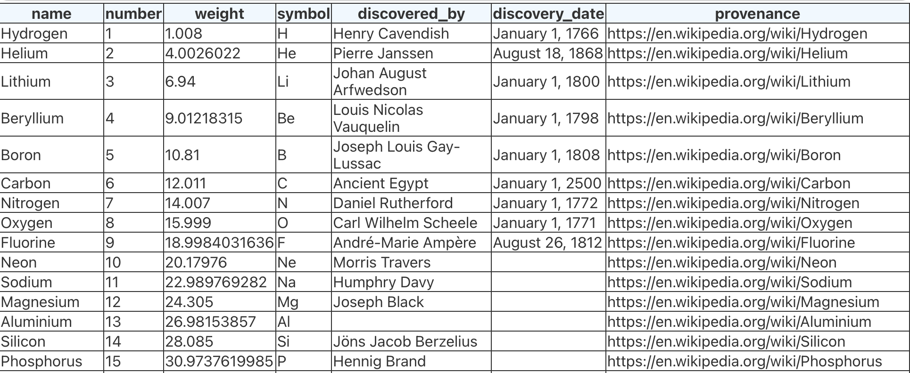
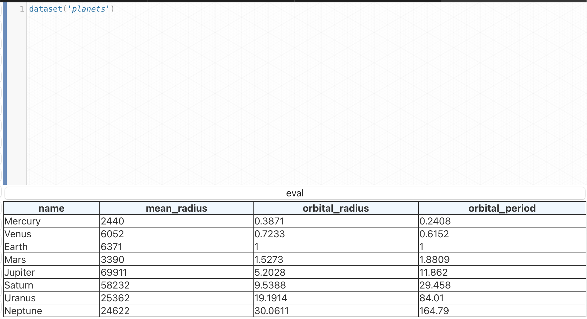
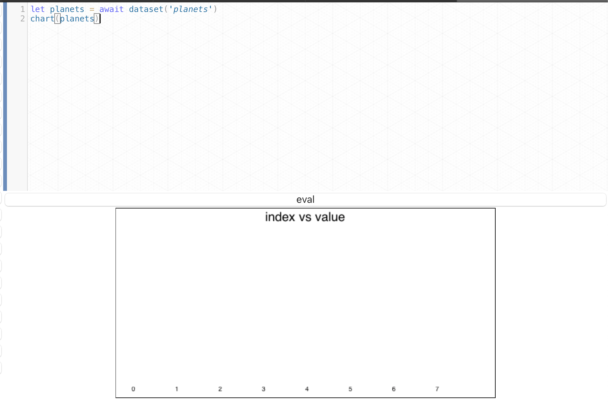
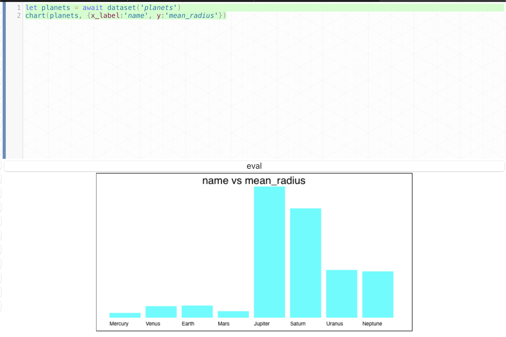
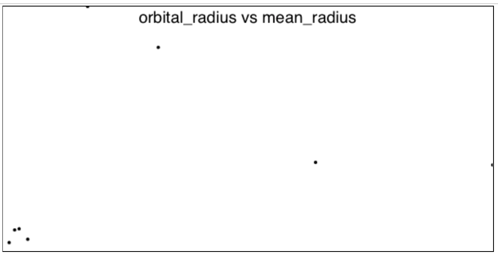
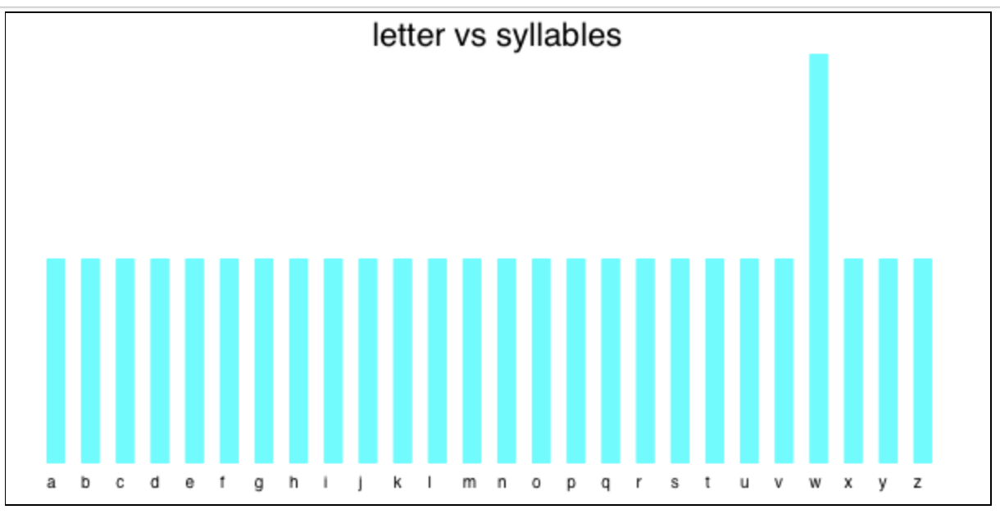
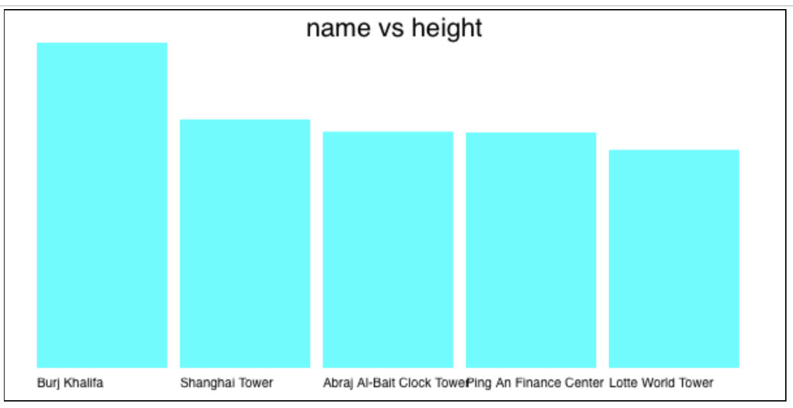

# HL Tutorial

Welcome to HL, a humanist programming language.  Computers are amazing. They can calculate incredible things super fast. They can aswer questions and draw graphics. However, computers are actually very dumb. All they do is simple
arithmetic. But they can do it super duper fast.  To do smart things humans have to teach them.  This is called programming. Anyone can program, including you!


# Arithmetic

HL understands arithmetic. Try typing in a math quesiton like `2+2` then press the 'run' button (or type control-return on your keyboard). HL will show you the answer: `4`.  Now try dividing 4 by 2 or multiplying 3 by 5. Type in `4/2`. Run it. Then type `3 * 5`  HL uses `/` to mean division and `*` for multiplication.

HL understands longer math equations too. For example, imagine you have a refridgerator box that is 7 feet tall by 4 feet wide by 4 feet deep. You could find out the volume of the box by multiplying all of the sides.

```javascript 
7 * 4 * 4
```

which equals 112.

### Units

In the above problem only *we* know that the `7` meant `7 feet`. The computer doesn't know because we didn't tell it. Fortunately HL lets us tell the computer exactly what units we mean. Let's try that again. Type:

```javascript
7 feet * 4 feet * 4 feet
```

Now we get `112 cuft`.  Cool. HL knows to convert the answer into cubic feet.  But what if we didn't want cubic feet. We are talking about voume and there are several different units that could represent volume. Let's ask HL to convert it into gallons instead.

```javascript
7 ft * 4 ft * 4 ft as gal
```

which gives us the answer `837.81 gallons`. 

Notice that this time we abbreviated `feet` to `ft` and `gal` for `gallons`.   HL understands the full names and abbrevations for over a hundred kinds of units, and it can convert between any of them.  Here's a few more examples to try.  

convert your height into centimeters. I'm 5'4", so

```javascript
5 feet + 4 inches as cm 
```
is
```
162.55cm
```

Some kitchen math:

```javascript
2 cups + 4 tablespoons
```
is
```javascript
36 tablespoons
```

Calculate your age in seconds.

```javascript
now() - date("Jan 1st, 2003") as seconds
```

If you try to convert something that can't be converted, like area to volume, then HL will let you know. Try this

```javascript
7ft * 4ft as gal
```
results in
```
Error. Cannot convert ft^2 to gallons.
```

Units are very important. They help make sure our calculations are correct. Even professionals get this wrong some times. [NASA once lost a space probe worth over 100 million dollars](https://www.latimes.com/archives/la-xpm-1999-oct-01-mn-17288-story.html) because the software didn't convert correctly between imperial and metric units. 

### Superman

Now lets try a more complex problem. In one of the Superman movies he flies so fast that the world turns backwards and reverses time. That got me thinking. Is that realistic? The earth is pretty big. How long would it really take him to fly around the world?

We need some information first. How fast can Superman fly? Apparently the comics are pretty vague about his speed. Some say it's faster than light, some say it's infinite, some say it's just slighly slower than The Flash.  Since this is about the real world let's go with an older claim, that [Superman is faster than a speeding bullet](https://screenrant.com/superman-faster-speeding-bullet-confirmed/).  According to the internet, the fastest bullet ever made was was the [.220 Swift](https://en.wikipedia.org/wiki/.220_Swift) which can regularly exceed 4,000 feet per second. [The fastest recorded shot was at 4,665 ft/s](https://www.quora.com/Whats-the-fastest-bullet-in-the-world-What-makes-it-so-fast-How-are-they-made), so we'll go with that.

Now wee need to know how big the earth is. The earth isn't perfectly spherical and of course it would depend on exactly which part of the earth superman flew, but [according to Wikipedia](https://en.wikipedia.org/wiki/Earth) the 
average (mean) radius of the Earth is *6,371.0* kilometers. 

Now we can divide these and convert to hours to see how long it would take.

```
 6371.0 km / 4000ft/s as hours
 ```
 equals

```
 1.45 hours
 ```

 So pretty fast. In fact. 
 
 Oh, wait, That's not right. We are using the radius of the earth, not the circumference.  We know the circumferce of a circle is 2\*pi\*radius. Let's try that again.

``` javascript
(6371.0 km * 3.14 * 2) / 4000ft/s as hours  
```
gives us 9.11 hours.

So still pretty fast. He could almost go three times around the earth in a single 24 hour day.


Programming is both fun and useful. We can instruct computers to help us answer all sorts of interesting questions.  In the next section we'll learn about groups of numbers called lists, and how to do interesting math with them.


# Lists


Now let's take a look at lists. Imagine you want to add up some numbers. You could do it by adding each number separately like this:

```javascript
4 + 5 + 6 + 7 + 8
```
or you could make them a list and use the sum function.

```javascript
sum([4,5,6,7,8])
```

Sum is a built in function that will add all of the items in a list. There are a lot
of other cool functions that work on lists.  You can sort a list

```javascript
sort([8,4,7,1])
// = [1,4,7,8]
```

get the length

```javascript
size([8,4,7,1])
// = 4
```

or combine sum and length to find the average
```javascript
let nums = [8,4,7,1] 
sum(nums) / size(num)
// average = 5
```

Sometimes you need to generate a list. Suppose you wanted to know the sum of every number from 0 to 100.
Of course you *could* write out the numbers directly, but HL has a way to generate lists for you. It's called range.

```javascript
// make a list from 0 to 9
range(10)
// = [0,1,2,3,4,5,6,7,8,9]
// sum the numbers from 0 to 99
sum(range(100))
// 4950
```

Range is flexible. You can give it both a start and end number, or even jump by steps.
```javascript
// 20 -> 30
range(20,30)
// [20,21,22,23,24,25,26,27,28,29]
// 0 -> 100 by tens
range(0,100,10)
// [0,10,20,30,40,50,60,70,80,90]
```

Remember that range will start at the minmum and go to one less than the max. So 0 to 10 will go up to 9.

HL can handle big lists. If you ask for range(0,10_000_000) it will show the the first few and then ... before the last few.

```javascript
//you can use underscores to separate digits. they will be stripped out before calculations
range(10_000_000)
// [0, 1, 2, 3 .... 99_999_998, 99_999_999]
```

Lists are very useful for lots of things, but sometimes you get more numbers than you need. Suppose you wanted all the numbers from from 0 to 20 minus then just the first three. Use take(list,3). Want just the last three use take(list,-3) 

```javascript
let list = range(10)  // [0,1,2,3,4,5,6,7,8,9]
take(list, 3)         // [0,1,2]
take(list, -3)        // [7,8,9]
```
You can also remove items from a list with drop

```javascript
drop(range(10), 8)  //remove the first 8
// = [8,9]
```

And finally you can join two lists together

```javascript
join([4,2], [8,6]) // [4, 2, 8, 6]
```

In addition to holding data, lists let you do things that you could do on a single number, but in bulk. You can add a number to a list

```javascript
1 + [1,2,3]  // [2,3,4]
```

or add two lists together

```javascript
[1,2,3] + [4,5,6] // [5,7,9]
```

it might seem strange to do math on lists, but it's actually quite useful. Image you had a list of prices and you want to offer a 20% discount, you can do that with a single mulitplication.

```javascript
let prices = [4.86, 5.23, 10.99, 8.43]
let sale_prices = 0.8 * prices
```

Suppose you sold lemonade on four weekends in april, and another four in july. It would be nice
to compare the sales for the different weekends to see if july did better thanks to warmer weather.
You can do this by just subtracting two lists.

```javascript
let april = [34, 44, 56, 42]
let july  = [67, 45, 77, 98]
july - april // [33, 1, 21, 56]
```

doing math with lists is also great for working with vectors.

```javascript
let V1 = [0,0,5]
let V2 = [1,0,1]

V1 + V2 // add vectors
V1 * V2 // dot product of vectors
sqrt(sum(power(V1,2))) // magnitude of vector
```


lists let you find data too. you can search for items using select and a small function. lets find
all of the primes up to 10000

```javascript
select(range(10_000), where:is_prime)
```

or all numbers evenly divisible by 5
```javascript
select( range(10_000), where: x => x mod 5 )
```

you can also apply functions to combine elements in a list in different ways. Consider
calculating at total of 1,2, and 3. Instead of adding numbers together indivdually or using 
the sum function you can apply addition over every element in the list. `add over [1,2,3]` This 
is the same as putting a plus between each number: `1 + 2 + 3`. All of these are the same:

```javascript
1 + 2 + 3
add over [1,2,3]
+ over [1,2,3]
sum([1,2,3])
reduce([1,2,3], with: (a,b)=>a+b)
```
Remember that `+` is the same thing as using the `add` function.  With this functionality we can create
our own factorial. If you remember, factorial of N is calculated by multiplying every lower number together with N.  So factorial of 4 is 1*2*3*4, which we can caluate with mul over [1*2*3*4]. Lets
do factorial of 100

```javascript
mul over range(0,100) //= 9.332622e+157
```


One of the coolest things about lists is that you can *draw* them. Just send a list into the chart() function to see it as a bar chart. Suppose you had a list of heights of your friends.

```javascript
chart([88,64,75,59])
```

or just draw the numbers from 0 to 9

```javascript
chart(range(0,10))
```

You can use `range` plus `mapping` to draw charts of `x`, `power(x,2)`, `sin()` or other math equations, though there are better ways to draw it than bar charts, but it does work.

```javascript
chart(map(range(0,10), x=>x))
chart(map(range(0,10), x=>power(x,2)))
chart(map(range(0,100), x=>sin(x/10)))
```

And one of the best parts about lists is that they can hold more than numbers. You can work with
lists of strings, numbers, booleans, or even records.  Consider this simple list of people.

```javascript
let friends = [
    { first:'Bart', last:'Simpson'},
    { first:'Homer', last:'Simpson'},
    { first:'Ned', last:'Flanders'},
]

show(friends)
```

the editor will show a list of records as a table, similar to a spreadhseet.

*screenshot*


# charts from lists and datasets

Even better than pulling in your own data, is working with curated datasets 
that have already been assembled.  HL comes with datsets for

* Periodic table of elements
* Letters of the English Alphabet
* Planets of the solar system
* Countries of the world.

When you load a dataset with

```javascript
let elements = await dataset('elements')
```
it looks like this:



Each column in the table is a field of each record in the datasets. 

Let's suppose you want to compare the sizes of the planets. First load the planets dataset. It looks like this:




Now add a chart to draw the planets. 



Hmm. That doesn't look right.  Chart doesn't
know what part of the planets dataset we want
to draw. We have to tell it. Let's use `mean_radius` for the height of the bar chart. For the label under each bar we can use the `name` property. We can tell the chart function what to do using the named arguments `x_label` and `y`.



Now let's compare the radius of the orbit to the radius of the planet. This will show us if the smaller planets are clustered together or spread out.

```javascript
let planets = await dataset('planets')
chart(planets, {type:'scatter', x:'orbital_radius', y:'mean_radius'})
```



Here's a fun one. Let's see which letters have one syllable vs two.

```javascript
chart(dataset('letters'), y_value:'syllables')
```



Let's check out the relative heights of the tallest buildings in the world:


```javascript
let buildings = await dataset('tallest_buildings')
let b2 = take(buildings,5) 
chart(b2, {y:'height', x_label:'name'})
```




- Charts and datasets
- Sounds and images
